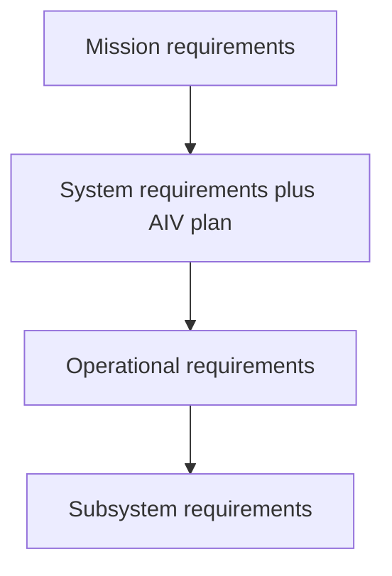
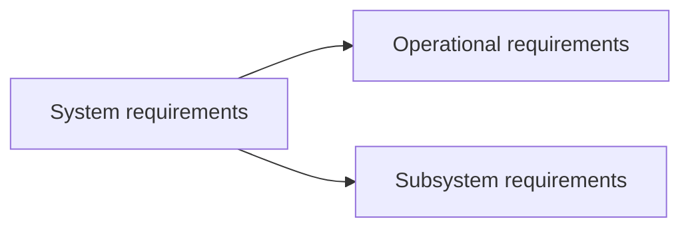
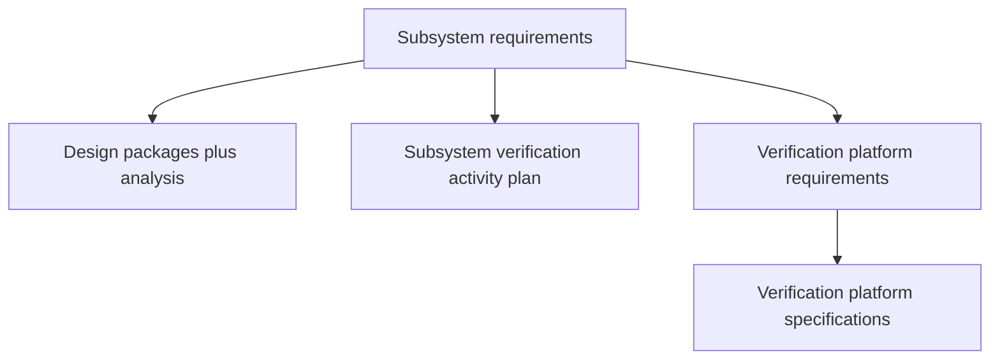

# Information architecture — artifacts and traceability

Living document. **Update when** domain types, workflows, or UX decisions change.

## Mission

Model hardware systems engineering so **teams at any scale** can maintain **one coherent graph**: requirements, design, verification, and evidence—with human experts signing off where judgment matters. **Touchpoints** (permissions, ceremony, audit, integrations) should vary by organization size without forking the underlying artifact model. **First customers:** small teams, where speed and clarity matter most.

## Artifact inventory

| Artifact | Purpose | Typical owner |
|----------|---------|----------------|
| Mission requirements | Program intent, stakeholder success | Lead systems + stakeholders |
| System requirements | Whole-system “shall” / constraints | Systems engineering |
| AIV plan (with system reqs) | Plan to verify the **integrated** system | Systems + integration + V&V |
| Operational requirements | Use, logistics, maintenance, training | Ops + systems |
| Subsystem requirements | Allocated requirements per subsystem | Subsystem leads + systems |
| Specifications | Quantified / interface detail | Engineering |
| Subsystem design packages | Architecture, budgets, ICD references | Design engineers |
| Analysis results | Models, simulations, calculations | Analysts |
| Verification plan | Scope, methods, success criteria | V&V lead |
| Verification activities | Analysis / test / inspection instances | V&V + labs |
| Activity reports | Evidence and conclusions per activity | Authors + reviewers |
| Test cases | Step-by-step or scripted verification | V&V |
| Verification platform requirements | Facilities, tools, sensors, software | V&V + facilities |
| Verification platform specifications | Detailed platform design / config | Platform owners |
| Compliance matrix | Requirement ↔ evidence, pass/fail/planned | Auto-derived + curated |

## Requirements graph

**Vertical lineage (each level drives the next in the stack):**

**Branching from system (explicit product rule):**

System requirements **also** drive subsystem requirements directly when allocation skips operational elaboration, or when operational and subsystem concerns must be traced in parallel. The **data model** should allow multiple parents or explicit `derives_from` links from one system requirement to **both** operational and subsystem children—never “lose” the system rationale.

## Downstream of subsystem requirements

## Consistency checks (automatable + human)

| Check | Question |
|-------|----------|
| Up-trace | Does every subsystem requirement trace to system (and ultimately mission)? |
| Lateral | Do interface definitions match between subsystems (ICD, loads, environments)? |
| Budgets | Mass, power, thermal, link margin—closed with no orphan assumptions? |
| Verification | Is every critical requirement covered by at least one planned method with an owner? |
| Platform | Do planned tests have the facilities and equipment they assume? |

Failing checks become **review tasks** for humans or fixes for agents—never silent overrides.

## Compliance matrix (Excel-simple)

**Rows:** requirements (or derived verification objectives).  
**Columns:** evidence items (test case ID, analysis report ID, inspection record).  
**Cells:** status + hyperlink to artifact revision + optional waiver reference.

Implementation note: store normalized relations in the backend; **project** or **export** flat matrices for auditors and suppliers.

## Mapping to code (`packages/domain`)

Today’s PoC types (`Requirement`, `SystemElement`, `TraceLink`) are intentionally minimal. Expected extensions (non-exhaustive):

- Requirement **kind** or **level** enum mirroring mission / system / operational / subsystem  
- Artifacts for plans, test cases, reports, platform specs  
- Richer `TraceLink.relation` vocabulary for verification and evidence  
- **Compliance matrix** as a query/view, not necessarily a single monolithic table type  

Document migrations here when enums or relations change.

---

*Last updated: 2026-05-10 — initial skeleton.*
