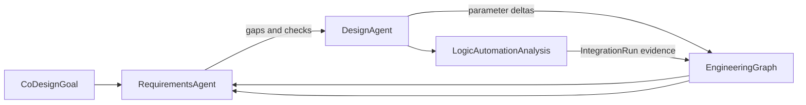
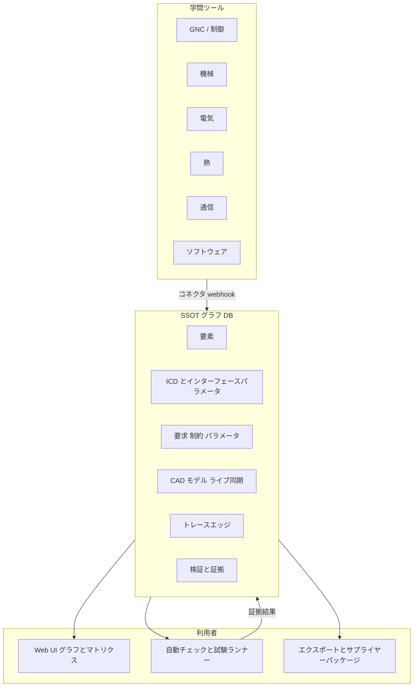
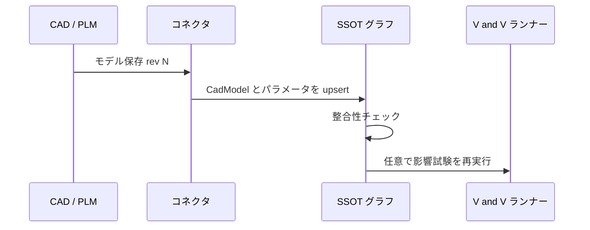
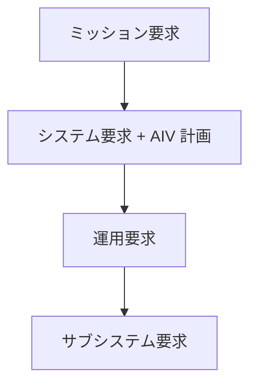
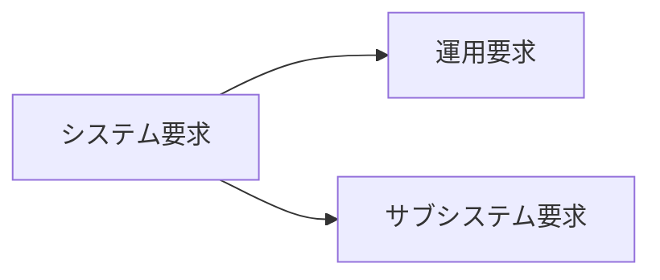
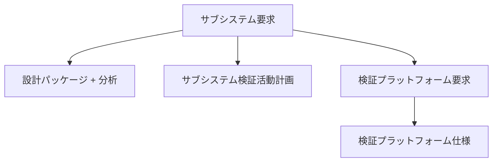

# 情報アーキテクチャ — アーティファクトとトレーサビリティ

ライブ文書。**ドメイン型、ワークフロー、UX 判断が変わったら更新**する。

## ミッション

ハードウェアのシステムエンジニアリングをモデル化し、**あらゆる規模のチーム**が**一貫したグラフ**—要求、設計、検証、証拠—を維持できるようにする。判断が要るところは人間専門家がサインオフする。

## 単一の真実の源泉（SSOT）

**最初のアーキテクチャ上の問い:** 真実はどこにあり、何が投影にすぎないか？

### SSOT であるもの（権威ある）

**プログラムエンジニアリンググラフ**が正規化ストア（データベース）にあり、**プログラム**と**構成**（例: V1 / V2）でスコープされる:

| 層 | SSOT が保持するもの | メモ |
|-------|----------|--------|
| **構造** | `SystemElement` ツリー（GNC、機械、電気、熱、通信、ソフトウェア…） | 1 グラフ；学問はタグと配分であり、別 DB ではない。 |
| **意図** | バージョン管理された**要求**（ミッション → サブシステム）+ ライフサイクル（`draft` → `baseline`） | 安定した顧客／ミッション意図 vs 派生トレード（下記）。 |
| **ICD** | サブシステムインターフェースごとの **Interface Control Document**（提供者 ↔ 消費者）+ **インターフェースパラメータ** | チーム横断合意の権威；横整合は ICD ペアを比較。 |
| **パラメータ** | **設計パラメータ**（値、単位、境界、学問、要素） | 要求、ICD 行、CAD 抽出値にリンク。 |
| **設計制約** | 詳細設計からの制限条件 | `actsAsFunctionalRequirement` が true のとき、機能要求と同様に**配分と V&V**に参加—「二級」メタデータではない。 |
| **CAD** | **CAD モデル**ノード（リビジョン、チェックサム、同期状態、要素リンク） | SSOT はモデルをプログラムグラフの一部とみなす；ジオメトリファイルは PLM／オブジェクトストレージだが、**設計変更のたびにリビジョンと抽出パラメータが SSOT で更新**（CAD 同期参照）。 |
| **トレースグラフ** | 型付き**エッジ**（`derives_from`、`satisfies`、`constrains`、`documents`、`represents`、`verifies` 等） | 要求階層、req↔param、req↔constraint、ICD↔要素、CAD↔要素、検証バインディング。 |
| **検証** | 計画、活動、**バインディング**、**証拠**（pass/fail、リビジョン、免除） | マトリクスはこれらリンクの**ビュー**。 |
| **決定** | トレード、免除、根拠アーティファクト | 重要な派生変更はすべてここにリンク。 |

シミュレーションデッキや生の試験記録は**オブジェクトストレージ**に置き、SSOT は**参照**のみ；詳細設計が始まれば **CAD はグラフ外ではない**。

### SSOT ではないもの（投影／ツール）

| SSOT ではない | 役割 |
|----------|------|
| Excel／コンプライアンスマトリクスエクスポート | 人間・サプライヤー・監査向けの読み取りモデル—**セルバインディング付きでバージョン管理された `DesignArtifact` として登録されない限り** |
| 学問ネイティブの著作用 UI（Simulink、spice、フライトソフト IDE、ベンチスクリプト） | **著作の権威**；コネクタ経由で SSOT に**同期**—CAD は下記のライブ同期ルールに従う |
| エージェントの起草 | 人間がベースラインするまで提案 |
| UI のグラフ／ツリービュー | SSOT へのクエリ |

### SSOT 変更アクター（人間・ロジック・AI）

権威あるグラフデータの変更はすべて**誰が**変更したかを記録する。3 種のアクター:

| アクター | 役割 | 典型例 |
|-------|------|------------------|
| **人間エンジニア** | 現実世界との接点；重要な根拠とベースラインを所有 | 要求編集、ベースラインサインオフ、トレード受理 |
| **ロジック自動化** | 決定的・反復可能—LLM なし | Excel→Python 同期、CI 試験ランナー、CAD コネクタ Webhook |
| **AI エージェント** | 管理者設定スコープ内で起草（デフォルト約 20%） | パラメータ更新提案、要求文のドラフト |

**ポリシー（`AgentScopePolicy`）:** 管理者が AI が行える非クリティカル変更の割合、ブロックするクリティカルティア（デフォルトで `critical` は人間のみ）、許可ノード種別を設定。ヘルパー: `packages/domain` の `canActorMutate`、`DEFAULT_AGENT_SCOPE_POLICY`。

**来歴:** 各変更は不変の `SsotProvenanceRecord`（アクター、フィールド、前後、クリティカルティ）。`aiTouchInHumanDomain` が true のとき UI は**警告**を出し、AI 提案が人間の設計判断に静かに染み込まないようにする。`apps/web` の **Actor boundaries** ビューを参照。

**AI の対象外:** クリティカルティアのアーティファクト、現実世界の試験実行、ベースライン権限、決定的ルールで足りるループ—代わりにロジック自動化を使う。

**自律 co-design モード（`autonomousCoDesign`）:** 有界な PoC ループでは、管理者が AI スコープを 100% に設定し、実行中の `CoDesignRun` がレビューキューを待たずに **derived** および **standard-tier** の変更を SSOT に直接適用できる。本モードは**探索反復の速度**用であり、人間の認定ではない: 来歴は必須、シミュレーション実行は `logic_automation` のまま、結果状態は外部の人間サインオフやリリース済み「検証済み」主張と**同等ではない**。

### 設計アーティファクト — Excel + Python（PoC 連携）

エンジニアは慣れたツールを使い続け、SSOT は `DesignArtifact` ノード（`excel_workbook`、`python_script`）として登録し、リビジョンと学問タグを付ける。

**最小連携単位:** `CellCodeBinding` — 1 Excel セル ↔ 1 Python `SSOT:PARAM:KEY` マーカー ↔ 1 `DesignParameter`。フロー:

1. 人間またはコネクタが Excel セル（または SSOT パラメータ）を更新。
2. **ロジック自動化**（`packages/design-integration`）がセル値を Python マーカーに伝播しスクリプトを再実行。
3. `IntegrationRun` が stdout／ステータスを記録—このループに AI は入らない。

CLI: `one-piece-sync --workbook … --script … --bind "Inputs!B2:P-VBUS:P-VBUS"`。

現在の PoC には、パラメータ変更の間に自律 co-design 実行が呼び出せる**熱排出スタンドイン**スクリプトも含まれる。スクリプト実行は境界の決定的側に留まる: AI が差分を提案し、`logic_automation` が分析を実行して `IntegrationRun` 証拠を SSOT に書き戻す。

### 自律 co-design ループ（PoC）

`CoDesignRun` は**目標駆動の設計反復**用の有界オーケストレーションオブジェクト。保持するもの:

- `CoDesignGoal`（自然言語の目的 + 数値目標メトリクス）
- 順序付き `CoDesignIteration` 記録（変更、メトリクス、要求チェック、リンクされた `IntegrationRun`）
- 実行ライフサイクル（`running`、`converged`、`max_iterations`、`failed`、`stopped`）

**プロダクトルール:** **アクティブ**な自律実行のみが人間レビューキューをバイパスでき、かつ現在の `AgentScopePolicy` が許すノード種別／ティアに限る。本モードではミッション意図は読み取り専用；下位設計トレードは速く進められるが、安定意図ルールは維持する。

**本 PoC 以降に延期:** PDF／ハンドブックの逆取り込み、ネイティブ SimScale／OpenMDAO アダプタ、SysML v2 シリアライズ／エクスポート、組織規模の協働ワークフロー。将来: 中央オーケストレータがマルチエージェント設計パイプラインでどのスクリプトを走らすか選択。

### 連携パターン（マルチ学問）

**柔軟性**は小さなカーネル（ノード、型付きエッジ、リビジョン、構成）+ アーティファクト種別ごとの**拡張属性**から—学問ごとに 1 テーブルではない。

### ICD（Interface Control Document）

各**サブシステムインターフェース**は SSOT 内の ICD ノード:

- **提供者**と**消費者**の `SystemElement` ID（両方グラフに存在すること）。
- **インターフェースパラメータ**（名前、方向、型、単位、min/max/nominal）、任意で共有**設計パラメータ**にリンク。
- 要求と同様のライフサイクルとベースライン；変更はパートナーサブシステムに対する**横**整合チェックを駆動。

サプライヤー向け PDF/Excel は ICD + パラメータの**投影**。

### 機能要求としての設計制約

**設計制約**は詳細設計で発見・強制される制限（エンベロープ、クリアランス、最大損失など）。プロダクトルール:

- `actsAsFunctionalRequirement: true` → **検証クロージャ**、コンプライアンスマトリクス行、リンク先への上トレースに含める。
- `false` → 記録された工学的事実、依然トレースするが、単独ではベースラインをブロックしない。

「要求文書」と「検証不能な」CAD 側ルールの分裂を避ける。

### CAD ライブ同期

設計が成熟すると **CAD モデルは SSOT ノード**であり、受動的添付ではない:

1. **コネクタ**（PLM Webhook、CAD API、エージェントウォッチャー）が保存／チェックインで発火。
2. SSOT が `CadModel.revision`、`checksum`、`syncStatus`、`lastSyncedAt` を更新。
3. **抽出パラメータ**（質量、重心、エンベロープ寸法など）が同一トランザクションでリンクされた `DesignParameter` を更新。
4. 下流の**チェック**（バジェットクロージャ、制約違反、古いマトリクス証拠）が即時実行。

同期失敗時は `syncStatus: stale | error` が、解消まで依存制約のベースラインをブロック。

### 検証と試験自動化

1. **Pull** — API／クエリが要求またはベースラインタグの**クロージャ**を返す: パラメータ、ICD、リンク活動、プラットフォームニーズ、最終証拠。
2. **Push** — 試験／分析ランナーが**証拠ノード**を書き込む（ステータス、run ID、アーティファクト URI、タイムスタンプ）；SSOT がマトリクス投影と整合チェックを更新。
3. **Automate** — `baseline` または構成変更時にチェックをキュー（カバレッジギャップ、孤立パラメータ、ICD 不一致、古い証拠）。pass/waive 判断の権威は人間。

PoC UI（`apps/web`）は投影を示す；**P1 永続化**はスプレッドシート型テーブルではなくこのグラフストアを実装すべき。

**タッチポイント**（権限、儀式、監査、連携）は組織規模で変わるがグラフは分岐しない。**最初の顧客:** 速度と明快さが重要な小規模チーム。

## アーティファクト一覧

| アーティファクト | 目的 | 典型オーナー |
|----------|---------|----------------|
| ミッション要求 | プログラム意図、ステークホルダー成功 | リード SE + ステークホルダー |
| システム要求 | システム全体の shall／制約 | システムエンジニアリング |
| AIV 計画（システム要求付き） | **統合**システムの検証計画 | SE + 統合 + V&V |
| 運用要求 | 使用、ロジスティクス、保守、訓練 | 運用 + SE |
| サブシステム要求 | サブシステムごとの配分要求 | サブシステムリード + SE |
| ICD | サブシステム間インターフェース合意 | SE + インターフェースオーナー |
| 設計パラメータ | バジェット、設定値、公差（CAD 同期可） | 学問リード |
| 設計制約 | 詳細設計の制限；機能要求として振る舞う場合あり | 設計エンジニアリング |
| CAD モデル（SSOT ノード） | ライブ同期付きリビジョンリンクのジオメトリ権威 | 機械／設計 |
| 仕様 | 要求を支える定量化詳細 | エンジニアリング |
| サブシステム設計パッケージ | アーキテクチャ、バジェット、分析要約 | 設計エンジニア |
| 分析結果 | モデル、シミュレーション、計算 | アナリスト |
| 検証計画 | 範囲、手法、成功基準 | V&V リード |
| 検証活動 | 分析／試験／検査のインスタンス | V&V + ラボ |
| 活動レポート | 活動ごとの証拠と結論 | 著者 + レビュア |
| テストケース | 段階的またはスクリプト化された検証 | V&V |
| 検証プラットフォーム要求 | 施設、ツール、センサ、ソフトウェア | V&V + 施設 |
| 検証プラットフォーム仕様 | プラットフォームの詳細設計／構成 | プラットフォームオーナー |
| コンプライアンスマトリクス | 要求 ↔ 証拠、pass/fail/planned | 自動導出 + キュレーション |

## 要求グラフ

**垂直系譜（各レベルが次を駆動）:**

## 安定した意図 vs 派生トレード

- **ミッション／顧客／ユーザー向け意図**は**明示・トレース・検証**してクロージャまで（マトリクス + 証拠）。
- **派生**要求、バジェット、インターフェース詳細は、分析や試験がより良い配分を示せば設計中に**変更**可能—各変更に**なぜ**を記録（根拠アーティファクト、試験／分析 ID へのリンク、またはエンジニアリング決定エントリ）。
- 有用な区別: *約束したユーザ向けものを検証する；実装方法は最適化し学ぶ。*

## システムからの分岐（明示的プロダクトルール）

運用の展開を飛ばす配分や、運用とサブシステムを並行トレースすべきとき、**システム要求はサブシステム要求も直接駆動**する。データモデルは 1 つのシステム要求から**運用とサブシステムの両方**の子へ、複数親または明示的 `derives_from` を許す—システムの根拠を「失わない」。

## サブシステム要求の下流

## 整合性チェック（自動化 + 人間）

| チェック | 問い |
|-------|----------|
| 上トレース | すべてのサブシステム要求がシステム（最終的にミッション）にトレースするか？ |
| 横 | **ICD** パラメータセットが提供者と消費者で一致するか？ |
| バジェット | 質量、電力、熱、リンクマージン—孤立仮定なくクローズか？ |
| CAD 鮮度 | `CadModel` リビジョンは同期されパラメータは最新か？ |
| 制約クロージャ | 機能要求として振る舞う**設計制約**に検証経路があるか？ |
| 検証 | すべてのクリティカル要求に、オーナー付きの計画された手法が少なくとも 1 つあるか？ |
| プラットフォーム | 計画試験が想定する施設・設備を持っているか？ |

失敗は人間またはエージェント修正用の**レビュータスク**—黙って上書きしない。

## 検証の厳しさ（ライフサイクル段階化）

ハードウェアプログラムは**何を**チェックするかだけでなく**なぜ**試験するかを区別することが多い。試験指向活動への任意メタデータ:

| 目的（典型） | 意図 |
|-------------------|--------|
| Development | マージン探索、弱点洗い出し、トレードへの情報 |
| Qualification | 有界最悪ケース／マージン条件での性能実証 |
| Acceptance | 納品ユニットの仕上げと再現性 |

**統合検証**（例: HITL、システムリグ、サービス様統合実行）は**検証活動** + **検証プラットフォーム要求／仕様**で表現—単一の物理ラボレイアウトを強制せず **Test what you fly** の考え方を支える。

分析と検査は第一級；試験が非現実的なときマトリクスセルを閉じられる。

自律 co-design PoC では、分析証拠は依然 **シミュレーション裏付け**であり「AI が宣言した」ものではない。ループはマトリクス投影とローカル探索状態を更新できるが、ベースライン、免除、外部向け「要求充足」主張の権威は人間に残る。

## コンプライアンスマトリクス（Excel 並み）

**行:** 要求（または派生検証目的）。  
**列:** 証拠（テストケース ID、分析レポート ID、検査記録）。  
**セル:** ステータス + アーティファクトリビジョンへのハイパーリンク + 任意の免除参照。

実装メモ: バックエンドに正規化関係を保持；監査・サプライヤー向けにフラットマトリクスを**投影**または**エクスポート**。

## コードへのマッピング（`packages/domain`）

`EngineeringGraph`（構成ごとの SSOT 形状）に含まれる:

| 型 | 役割 |
|------|------|
| `Requirement` | 意図；`kind`: `stakeholder` \| `functional` \| `design_constraint` |
| `InterfaceControlDocument` + `InterfaceParameter` | ICD とインターフェース行 |
| `DesignParameter` | 名前付きパラメータ |
| `DesignConstraint` | 詳細制限；V&V 用 `actsAsFunctionalRequirement` |
| `CadModel` | ライブ同期 CAD ノード（`syncStatus`、`revision`、抽出 param） |
| `DesignArtifact` | SSOT 内のバージョン管理 Excel または Python |
| `CellCodeBinding` | Excel セル ↔ Python マーカー ↔ 設計パラメータ |
| `AgentScopePolicy` | 管理者 AI スコープ（デフォルト約 20%）；`SsotProvenanceRecord` 監査証跡 |
| `TraceLink` | `TraceRelation` 語彙 |
| `Program` | 構成スコープグラフ + 検証投影 + 来歴 |

ヘルパー: `isVerificationSubject`、`isVerificationSubjectConstraint`。

今後: 証拠アーティファクト、プラットフォーム仕様、決定記録、P1 永続化/API、CAD/PLM コネクタ。

列挙や関係が変わったらここに移行を文書化する。

---

*最終更新: 2026-05-30 — 自律 co-design、ドキュメント日本語化（アクター境界・来歴・Excel/Python 連携を含む）。*
