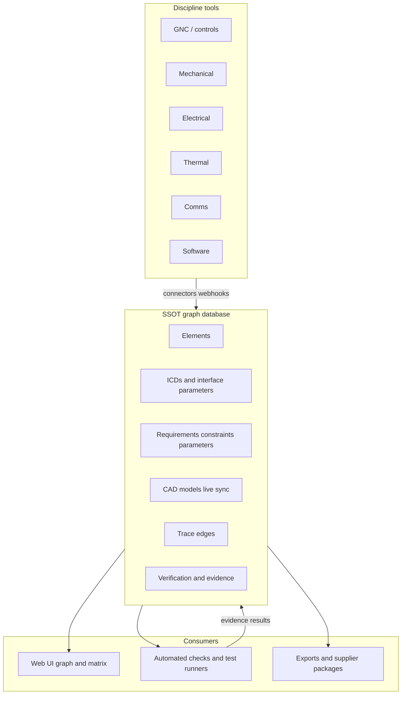
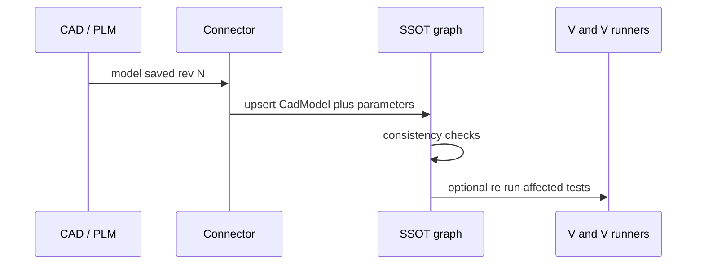
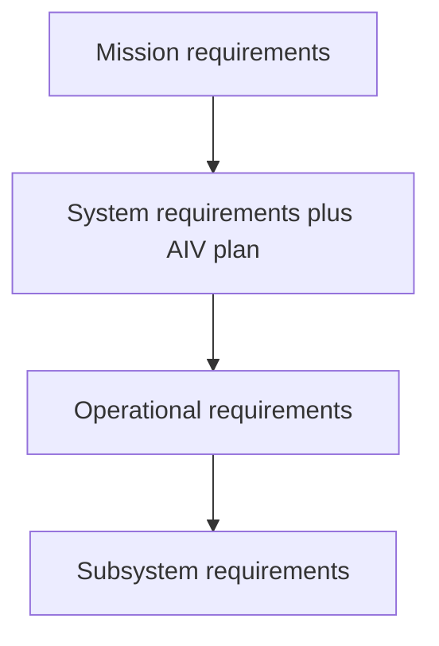
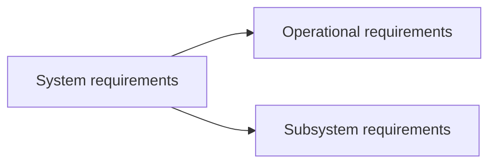
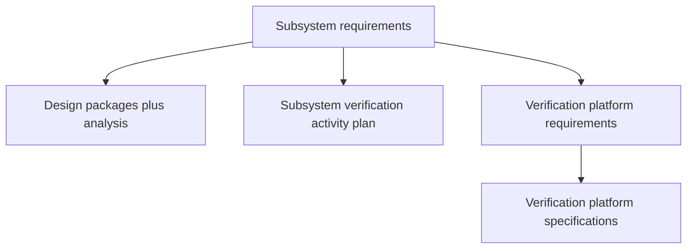

# Information architecture — artifacts and traceability

Living document. **Update when** domain types, workflows, or UX decisions change.

## Mission

Model hardware systems engineering so **teams at any scale** can maintain **one coherent graph**: requirements, design, verification, and evidence—with human experts signing off where judgment matters.

## Single source of truth (SSOT)

**The first architectural question:** where does truth live, and what is only a projection?

### What is SSOT (authoritative)

The **program engineering graph** in a normalized store (database), scoped by **program** and **configuration** (e.g. V1 / V2):

| Layer | SSOT holds | Notes |
|-------|----------|--------|
| **Structure** | `SystemElement` tree (GNC, mechanical, electrical, thermal, comms, software, …) | One graph; disciplines are tags and allocations, not separate databases. |
| **Intent** | Versioned **requirements** (mission → subsystem) + lifecycle (`draft` → `baseline`) | Stable customer/mission intent vs derived trades (see below). |
| **ICD** | **Interface Control Documents** per subsystem interface (provider ↔ consumer) + **interface parameters** (signals, limits, units) | Authoritative cross-team agreement; lateral consistency checks compare ICD pairs. |
| **Parameters** | **Design parameters** (value, unit, bounds, discipline, element) | Linked to requirements, ICD lines, and CAD-extracted values. |
| **Design constraints** | Limiting conditions from detailed design | When `actsAsFunctionalRequirement` is set, they **participate in allocation and V&V** like functional requirements—not “second class” metadata. |
| **CAD** | **CAD model** nodes (revision, checksum, sync status, element link) | SSOT treats the model as part of the program graph; geometry files live in PLM/object storage but **revision and extracted parameters update in SSOT on every design change** (see CAD sync). |
| **Trace graph** | Typed **edges** (`derives_from`, `satisfies`, `constrains`, `documents`, `represents`, `verifies`, …) | Req hierarchy, req↔param, req↔constraint, ICD↔elements, CAD↔element, verification bindings. |
| **Verification** | Plans, activities, **bindings**, **evidence** (pass/fail, revision, waiver) | Matrix is a **view** over these links. |
| **Decisions** | Trades, waivers, rationale artifacts | Every material derived change links here. |

Simulation decks and raw test recordings stay in **object storage** with SSOT **references**; **CAD is not “off-graph”** once detailed design begins.

### What is not SSOT (projections / tools)

| Not SSOT | Role |
|----------|------|
| Excel / compliance matrix export | Read model for humans, suppliers, auditors — **unless registered** as a versioned `DesignArtifact` with cell bindings (see below) |
| Discipline-native authoring UIs (Simulink, spice, flight software IDE, bench scripts) | **Authoritative for authoring**; **sync into** SSOT via connectors—CAD follows the live-sync rule below |
| Agent drafts | Proposals until human baseline |
| UI graph/tree views | Queries over SSOT |

### SSOT mutation actors (human · logic · AI)

Every change to authoritative graph data records **who** mutated it. Three actor kinds:

| Actor | Role | Typical examples |
|-------|------|------------------|
| **Human engineer** | Interfaces with the real world; owns critical rationale and baselines | Requirement edits, baseline sign-off, accepting trades |
| **Logic automation** | Deterministic, repeatable — no LLM | Excel→Python sync, CI test runners, CAD connector webhooks |
| **AI agent** | Drafts within admin-configured scope (~20% default) | Suggested parameter updates, draft requirement text |

**Policy (`AgentScopePolicy`):** administrators configure the fraction of non-critical mutations AI may perform, blocked criticality tiers (`critical` stays human-only by default), and allowed node kinds. Helpers: `canActorMutate`, `DEFAULT_AGENT_SCOPE_POLICY` in `packages/domain`.

**Provenance:** each mutation is an immutable `SsotProvenanceRecord` (actor, field, before/after, criticality). When `aiTouchInHumanDomain` is true, the UI **must** surface a warning so AI suggestions do not silently infect human design judgment. See **Actor boundaries** view in `apps/web`.

**Out of scope for AI:** critical-tier artifacts, real-world test execution, baseline authority, and any loop where deterministic rules suffice — use logic automation instead.

**Autonomous co-design mode (`autonomousCoDesign`):** for bounded PoC loops, administrators may set AI scope to 100% so a running `CoDesignRun` can apply **derived** and **standard-tier** changes directly to SSOT without waiting in the review queue. This mode is for **exploratory iteration speed**, not human certification: provenance stays mandatory, simulation execution remains `logic_automation`, and the resulting state is **not** equivalent to external human sign-off or a released “verified” claim.

### Design artifacts — Excel + Python (PoC integration)

Engineers keep using familiar tools; SSOT registers them as `DesignArtifact` nodes (`excel_workbook`, `python_script`) with revision and discipline tags.

**Minimum integration unit:** `CellCodeBinding` — one Excel cell ↔ one Python `SSOT:PARAM:KEY` marker ↔ one `DesignParameter`. Flow:

1. Human or connector updates Excel cell (or SSOT parameter).  
2. **Logic automation** (`packages/design-integration`) propagates cell value into the Python marker and re-runs the script.  
3. `IntegrationRun` records stdout / status — no AI in this loop.

CLI: `one-piece-sync --workbook … --script … --bind "Inputs!B2:P-VBUS:P-VBUS"`.

The current PoC also includes a **thermal rejection stand-in** script that autonomous co-design runs can call between parameter mutations. Script execution still sits on the deterministic side of the boundary: AI proposes deltas; `logic_automation` runs the analysis and writes `IntegrationRun` evidence back to SSOT.

### Autonomous co-design loop (PoC)

`CoDesignRun` is a bounded orchestration object for **goal-driven design iteration**. It holds:

- A `CoDesignGoal` (natural-language objective + numeric target metrics)  
- Ordered `CoDesignIteration` records (mutations, metrics, requirement checks, linked `IntegrationRun`s)  
- Run lifecycle (`running`, `converged`, `max_iterations`, `failed`, `stopped`)  

```mermaid
flowchart LR
  Goal[CoDesignGoal]
  ReqA[RequirementsAgent]
  DesA[DesignAgent]
  SimA[LogicAutomationAnalysis]
  Graph[EngineeringGraph]

  Goal --> ReqA
  Graph --> ReqA
  ReqA -->|\"gaps and checks\"| DesA
  DesA -->|\"parameter deltas\"| Graph
  DesA --> SimA
  SimA -->|\"IntegrationRun evidence\"| Graph
  Graph --> ReqA
```

**Product rule:** only the **active** autonomous run may bypass the human review queue, and only for node kinds/tiers that current `AgentScopePolicy` allows. Mission intent remains read-only in this mode; lower-tier design trades can move fast, but the stable-intent rule still holds.

**Deferred beyond this PoC:** PDF / handbook reverse-ingestion, native SimScale / OpenMDAO adapters, SysML v2 serialization/export, and organization-scale collaboration workflows.

### Integration pattern (multi-discipline)



**Flexibility** comes from a small kernel (nodes, typed edges, revisions, configurations) plus **extensible attributes** per artifact kind—not from one table per discipline.

### ICD (Interface Control Document)

Each **subsystem interface** is an ICD node in SSOT:

- **Provider** and **consumer** `SystemElement` IDs (both must exist in the graph).  
- **Interface parameters** (name, direction, type, unit, min/max/nominal) optionally linked to shared **design parameters**.  
- Lifecycle and baseline like requirements; changes drive **lateral** consistency checks against the partner subsystem.

Exports to PDF/Excel for suppliers are **projections** of ICD + parameters.

### Design constraints as functional requirements

**Design constraints** express limits discovered or enforced during detailed design (envelope, clearance, max loss, etc.). Product rule:

- `actsAsFunctionalRequirement: true` → included in **verification closure**, compliance matrix rows, and up-trace to system/mission where linked.  
- `false` → recorded engineering fact, still traced, but does not block baseline alone.

This avoids a split between “requirements doc” and “unverifiable” CAD-side rules.

### CAD live sync

When design matures, **CAD models are SSOT nodes**, not passive attachments:

1. **Connector** (PLM webhook, CAD API, or agent watcher) fires on save/check-in.  
2. SSOT updates `CadModel.revision`, `checksum`, `syncStatus`, `lastSyncedAt`.  
3. **Extracted parameters** (mass, CG, envelope dimensions, etc.) update linked `DesignParameter` nodes in the same transaction.  
4. Downstream **checks** (budget closure, constraint violation, stale matrix evidence) run immediately.

If sync fails, `syncStatus: stale | error` blocks baseline of dependent constraints until resolved.



### Verification and test automation

1. **Pull** — API/query returns the **closure** for a requirement or baseline tag: parameters, ICDs, linked activities, platform needs, last evidence.  
2. **Push** — Test/analysis runners write **evidence nodes** (status, run ID, artifact URI, timestamp); SSOT updates matrix projections and consistency checks.  
3. **Automate** — On `baseline` or config change, enqueue checks (coverage gaps, orphaned params, ICD mismatch, stale evidence). Humans remain authority for pass/waive judgment.

PoC UI (`apps/web`) demonstrates projections; **P1 persistence** should implement this graph store, not spreadsheet-shaped tables as the primary schema.

**Touchpoints** (permissions, ceremony, audit, integrations) vary by organization size without forking the graph. **First customers:** small teams, where speed and clarity matter most.

## Artifact inventory

| Artifact | Purpose | Typical owner |
|----------|---------|----------------|
| Mission requirements | Program intent, stakeholder success | Lead systems + stakeholders |
| System requirements | Whole-system “shall” / constraints | Systems engineering |
| AIV plan (with system reqs) | Plan to verify the **integrated** system | Systems + integration + V&V |
| Operational requirements | Use, logistics, maintenance, training | Ops + systems |
| Subsystem requirements | Allocated requirements per subsystem | Subsystem leads + systems |
| Interface Control Document (ICD) | Cross-subsystem interface agreement (provider/consumer, parameters) | Systems + interface owners |
| Design parameters | Budgets, setpoints, tolerances (may sync from CAD) | Discipline leads |
| Design constraints | Detailed-design limits; may act as functional requirements | Design engineering |
| CAD model (SSOT node) | Revision-linked geometry authority with live sync | Mechanical / design |
| Specifications | Quantified detail supporting requirements | Engineering |
| Subsystem design packages | Architecture, budgets, analysis summaries | Design engineers |
| Analysis results | Models, simulations, calculations | Analysts |
| Verification plan | Scope, methods, success criteria | V&V lead |
| Verification activities | Analysis / test / inspection instances | V&V + labs |
| Activity reports | Evidence and conclusions per activity | Authors + reviewers |
| Test cases | Step-by-step or scripted verification | V&V |
| Verification platform requirements | Facilities, tools, sensors, software | V&V + facilities |
| Verification platform specifications | Detailed platform design / config | Platform owners |
| Compliance matrix | Requirement ↔ evidence, pass/fail/planned | Auto-derived + curated |

## Requirements graph

**Vertical lineage (each level drives the next in the stack):**



## Stable intent vs derived trades

- **Mission / customer / user-facing intent** should remain **explicit, traced, and verified** to closure (matrix + evidence).  
- **Derived** requirements, budgets, and interface details may **change** during design when analysis or test shows a better allocation—each change should record **why** (rationale artifact, link to test/analysis ID, or engineering decision entry).  
- This mirrors the useful distinction: *verify what you promised users; optimize and learn how you implement it.*

## Branching from system (explicit product rule)

System requirements **also** drive subsystem requirements directly when allocation skips operational elaboration, or when operational and subsystem concerns must be traced in parallel. The **data model** should allow multiple parents or explicit `derives_from` links from one system requirement to **both** operational and subsystem children—never “lose” the system rationale.



## Downstream of subsystem requirements



## Consistency checks (automatable + human)

| Check | Question |
|-------|----------|
| Up-trace | Does every subsystem requirement trace to system (and ultimately mission)? |
| Lateral | Do **ICD** parameter sets match between provider and consumer? |
| Budgets | Mass, power, thermal, link margin—closed with no orphan assumptions? |
| CAD freshness | Are `CadModel` revisions synced and parameters current? |
| Constraint closure | Do **design constraints** acting as functional reqs have verification paths? |
| Verification | Is every critical requirement covered by at least one planned method with an owner? |
| Platform | Do planned tests have the facilities and equipment they assume? |

Failing checks become **review tasks** for humans or fixes for agents—never silent overrides.

## Verification rigor (lifecycle ramp)

Hardware programs often distinguish **why** a test exists, not only **what** it checks. Optional metadata on test-oriented activities:

| Purpose (typical) | Intent |
|-------------------|--------|
| Development | Explore margins, flush out weaknesses, inform trades |
| Qualification | Demonstrate performance in bounded worst-case / margin conditions |
| Acceptance | Workmanship and repeatability on delivered units |

**Integrated verification** (e.g. hardware-in-the-loop, system rigs, “service-like” integrated runs) is expressed as **verification activities** plus **verification platform requirements/specifications**—supporting a **test what you fly** mindset without mandating a single physical lab layout.

Analysis and inspection remain first-class; they may close matrix cells where tests are impractical.

For the autonomous co-design PoC, analysis evidence is still **simulation-backed** rather than “AI declared”. The loop can update matrix projections and local exploration state, but humans remain authority for baselines, waivers, and any externally-facing “requirements met” claim.

## Compliance matrix (Excel-simple)

**Rows:** requirements (or derived verification objectives).  
**Columns:** evidence items (test case ID, analysis report ID, inspection record).  
**Cells:** status + hyperlink to artifact revision + optional waiver reference.

Implementation note: store normalized relations in the backend; **project** or **export** flat matrices for auditors and suppliers.

## Mapping to code (`packages/domain`)

`EngineeringGraph` (SSOT shape per configuration) includes:

| Type | Role |
|------|------|
| `Requirement` | Intent; `kind`: `stakeholder` \| `functional` \| `design_constraint` |
| `InterfaceControlDocument` + `InterfaceParameter` | ICD and interface lines |
| `DesignParameter` | Named parameters |
| `DesignConstraint` | Detailed limits; `actsAsFunctionalRequirement` for V&V |
| `CadModel` | Live-synced CAD node (`syncStatus`, `revision`, extracted params) |
| `DesignArtifact` | Versioned Excel workbook or Python script in SSOT |
| `CellCodeBinding` | Excel cell ↔ Python marker ↔ design parameter |
| `AgentScopePolicy` | Admin AI scope (~20% default); `SsotProvenanceRecord` audit trail |
| `TraceLink` | `TraceRelation` vocabulary |
| `Program` | Configuration-scoped graph + verification projection + provenance |

Helpers: `isVerificationSubject`, `isVerificationSubjectConstraint`.

Still expected: evidence artifacts, platform specs, decision records, P1 persistence/API, CAD/PLM connectors.

Document migrations here when enums or relations change.

---

*Last updated: 2026-06-16 — documentation reorganized under `docs/ja/` and `docs/en/`.*
