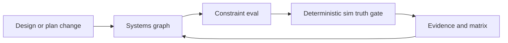

# Competitor methods and adoption tradeoffs

Cross-program design policy for **One Piece Engineering** and **Engineering Agents** (not tied to a single program folder).

Source: One Piece Engineering market survey PDF (8 vendors, 2026-07-12) plus public product pages.  
Purpose: choose patterns for **constraint-backed automatic verification**, **data joining**, and **AI agent assembly**—without naive requirement_id → shell auto-binding.

## Vendor snapshot

| Layer | Vendor | Data joining | Automation | AI agents |
|-------|--------|--------------|------------|-----------|
| ① Orchestration | Synera | 76+ CAx/PLM workflow links | Analysis/optimization pipelines | Supervisor + specialist agents |
| ① | Dyad | Intent → physics-consistent models (JuliaHub) | Fast iterative sim; safety-oriented codegen | Intent-to-model construction |
| ② Agile infra | Antaris | Design Studio + twin + flight OS | Pre-build virtual mission verification | AI-for-space platform features |
| ② | SysGit | Textual requirements/IF/models on Git SSOT | Branch/PR/CI; SysML v2 generation | Ingest / automation suite |
| ② | Flow | CAD/CAE/Python/Jira/Git digital thread | Threshold Pass/Fail on params | Impact / budget-style agents |
| ③ Mega / assist | Dassault | Cameo / 3DEXPERIENCE | Unstructured req → SysML structure | NLP / semantic assist |
| ③ | Siemens | NX / Simcenter / Teamcenter | NL → geometry reasoning → mesh/BC/report | In-CAD simulation automation |
| ③ | CoLab | Drawing/CAD review platform | AutoReview (DFM/GD&T/standards) | Knowledge-graph assist |

## Adoption decisions (One Piece / EA)

| Pattern | Decision | Rationale |
|---------|----------|-----------|
| System graph + constraint evaluation (Flow-like) | **Adopt (policy)** | Constraints are the verification center; falsehoods fail thresholds/evidence |
| Git-hosted machine-readable SE + PR/CI (SysGit-like) | **Adopt (near-term)** | Fits this docs/`model` layout; pytest / 2-run as reference scenarios |
| Supervisor + specialist agents (Synera-like) | **Adopt (EA ConOps)** | L1 + L2 loop; AI runs design–verify to cut human time bottleneck |
| Physics-consistent sim / twin gate (Dyad/Antaris-like) | **Adopt (truth)** | Filters AI falsehoods with deterministic evaluation |
| Requirements structure Copilot (Dassault-like) | **Later candidate** | Drafting assist only |
| Local CAD/CAE automation (Siemens-like) | **Hold** | Part-level focus |
| DFM AutoReview (CoLab-like) | **Hold** | Drawing-review specialty |
| requirement_id → shell auto-binding | **Reject** | Graph + constrain + truth gate is the spine |

## Stance on humans and truth

- Human decision gating as the **default** path creates **time bottleneck**.
- AI drives the design–verification loop.
- AI can lie; **truth-seeking** must be enforced via deterministic sim, constraints, and evidence.

## Constraint-backed verification loop

Example application (EA software model): [programs/engineering_agents/system_model.md](programs/engineering_agents/system_model.md).
