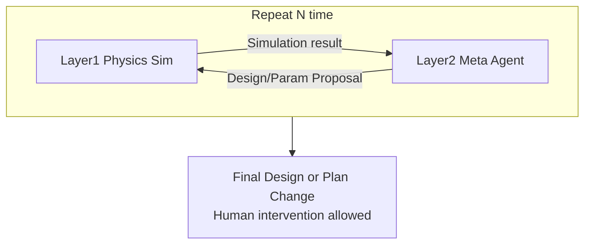

# Engineering Agents — Concept of Operations

Program: **Engineering Agents** (software), managed under One Piece Engineering as the first example program.  
Domain/plant physics (cabin atmosphere, scrubbers, etc.) are **not** requirements of this software program; they belong to domain models exercised *by* the agents.

## Purpose

Accelerate hardware-oriented design and verification loops with a **deterministic truth gate**. Large language models may propose; they do not self-certify.

## Operating loop

1. **Layer 1 — Physics simulation**  
   Run the plant/backend scenario. Multiple agents perform anomaly detection → root-cause → operational response (temporary ops actions).

2. **Layer 2 — Meta-agent evaluation**  
   Evaluate simulation results and emit a **design or parameter proposal** for the next iteration.

3. **Repeat N times**  
   **N is set by the operator.**

4. **Output**  
   **Final Design or Plan Change.** Human intervention is allowed; intervening introduces **time bottleneck**.

## Authority and truth

- The design–verification loop is driven by **AI agents** to avoid human decision latency as the default path.
- **Truth seeking is mandatory:** proposals are accepted only with materials from deterministic simulation, constraints, and evidence—not LLM self-assertion alone.
- Humans may intervene (stop, reject, change N, refuse a proposal). Intervention is possible; habitual gating reintroduces time bottleneck.

## Minimum success (validation gate)

1. **Cycle 1:** Run L1↔L2 (N ≥ 1) and emit a non-empty design/parameter proposal.  
2. **Cycle 2:** Apply the proposal and re-simulate; **results differ** from Cycle 1.

Anchored in software verification case `VC-ea-loop-2run` (see [verification.md](verification.md)).

## Related artifacts

- [requirements.md](requirements.md)
- [system_model.md](system_model.md)
- [validation.md](validation.md)
