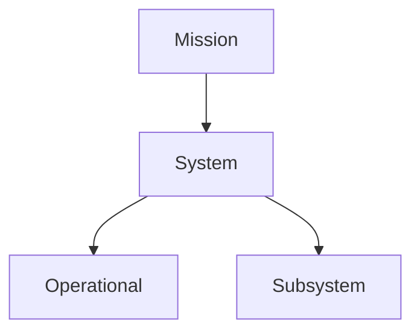

# Engineering Agents — Requirements

Software requirements for the Engineering Agents program.  
Canonical IDs and relations: [system_model.md](system_model.md), [model/requirements.yaml](model/requirements.yaml).

## Hierarchy

Parent drives child via `derive(parent, child)`.

## Mission

| ID | Shall |
|----|-------|
| `EA-SW-MIS-001` | The Engineering Agents software shall accelerate hardware-oriented design–verification loops under a deterministic truth gate. |

## System

| ID | Shall |
|----|-------|
| `EA-SW-SYS-010` | The system shall execute Layer-1 physics simulation and Layer-2 meta-agent evaluation for an operator-specified iteration count N and shall emit a Final Design or Plan Change. |
| `EA-SW-SYS-020` | The system shall judge proposal truth using deterministic simulation results, constraints, and evidence only; LLM self-assertion alone shall not constitute a pass. |

`derive(EA-SW-MIS-001, EA-SW-SYS-010)`, `derive(EA-SW-MIS-001, EA-SW-SYS-020)`.

## Operational

| ID | Shall |
|----|-------|
| `EA-SW-OPS-010` | An operator shall be able to specify N, scenario, agents_mode, run_id, and whether/which proposals to apply, then execute the loop. |
| `EA-SW-OPS-020` | The system shall allow human intervention; habitual intervention may introduce time bottleneck. |

`derive(EA-SW-SYS-010, EA-SW-OPS-010)`, `derive(EA-SW-SYS-010, EA-SW-OPS-020)`.

## Subsystem

| ID | Shall |
|----|-------|
| `EA-SW-SUB-CLI-010` | The CLI subsystem shall provide run control, results inspection, and diagnostics. |
| `EA-SW-SUB-SCN-010` | The scenario subsystem shall orchestrate simulation and agent execution. |
| `EA-SW-SUB-AGT-010` | The agents subsystem shall perform L1 operational response and L2 meta evaluation with design/parameter proposals. |
| `EA-SW-SUB-ENV-010` | The environment subsystem shall isolate the interface to the external sim / plant backend. |
| `EA-SW-SUB-CORE-010` | The core subsystem shall own shared state, proposal schema, and persistence of run artifacts. |

`derive(EA-SW-SYS-010, EA-SW-SUB-SCN-010)`, `derive(EA-SW-SYS-010, EA-SW-SUB-AGT-010)`,  
`derive(EA-SW-SYS-020, EA-SW-SUB-ENV-010)`, `derive(EA-SW-SYS-020, EA-SW-SUB-CORE-010)`,  
`derive(EA-SW-OPS-010, EA-SW-SUB-CLI-010)`.

## Notes

- These are **software** requirements. Domain/plant shalls are not listed here.
- Trace to verification: see [verification.md](verification.md) and [matrix.md](matrix.md).
