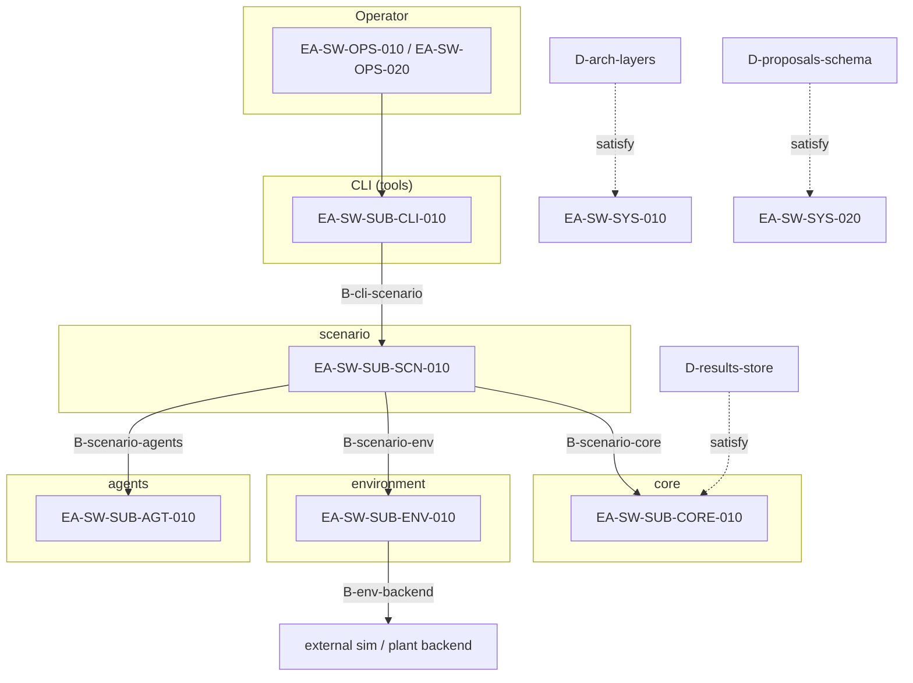
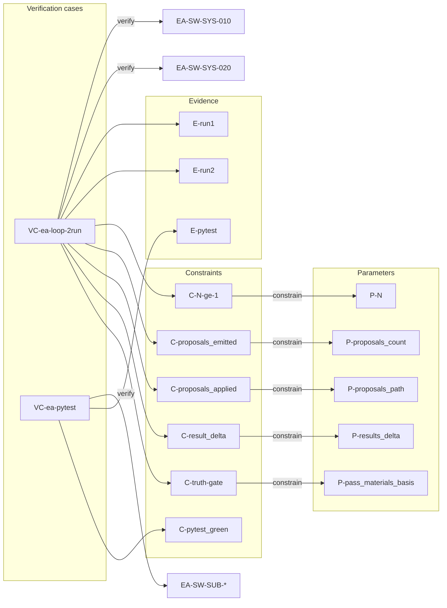
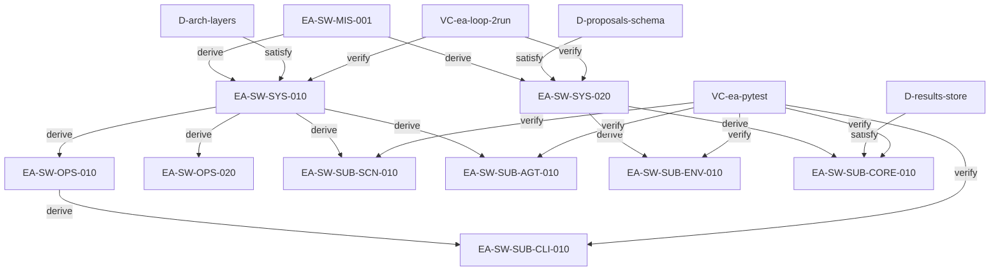

# Engineering Agents — System model

Canonical software system model for the Engineering Agents program.  
Machine-readable twin: [model/system_model.yaml](model/system_model.yaml).  
Relation legend matches One Piece SE practice (verb base forms; SysML-inspired distinctions without full SysML compliance).

## Scope

- **In scope:** EA *software* requirements, parameters, constraints, boundaries, design elements, verification cases, evidence.
- **Out of model as requirements:** domain/plant physics (those are content the software may simulate, not this program’s requirement nodes).

## System model diagram

Layered software architecture, boundaries (`allocate`), and external backend. Domain/plant physics sit outside this software model.

Verification cases, constraints, and evidence close the loop on system requirements (truth gate: no LLM self-certification).

## Relation legend

| Relation | Form | Meaning |
|----------|------|---------|
| **derive** | `derive(parent, child)` | Parent requirement drives/decomposes into child |
| **satisfy** | `satisfy(design, requirement)` | Design/implementation claims to meet a requirement |
| **verify** | `verify(verification_case, requirement)` | Verification case proves a requirement |
| **allocate** | `allocate(element, requirement)` | Boundary/subsystem owns responsibility for a requirement |
| **constrain** | `constrain(constraint, parameter)` | Constraint binds a parameter |

**Verification case (first-class):** must state *which* requirement(s), *by what means*, and *how judged* (constraint / pass criteria).

Node kinds: `requirement`, `parameter`, `constraint`, `boundary`, `design`, `verification_case`, `evidence`.

## Requirements

| ID | Statement |
|----|-----------|
| `EA-SW-MIS-001` | Accelerate hardware-oriented design–verification loops with a deterministic truth gate |
| `EA-SW-SYS-010` | Execute L1↔L2 for operator-specified N and emit Final Design or Plan Change |
| `EA-SW-SYS-020` | Base proposal truth materials on deterministic sim / constraints / evidence only (no LLM self-certification) |
| `EA-SW-OPS-010` | Operator can set N, scenario, agents_mode, run_id, and proposal application |
| `EA-SW-OPS-020` | Allow human intervention (intervention may introduce time bottleneck) |
| `EA-SW-SUB-CLI-010` | CLI provides run, results inspection, and diagnostics |
| `EA-SW-SUB-SCN-010` | scenario orchestrates simulation and agent execution |
| `EA-SW-SUB-AGT-010` | agents perform L1 (ops response) and L2 (meta evaluation / design–param proposal) |
| `EA-SW-SUB-ENV-010` | environment isolates the boundary to external sim / plant backend |
| `EA-SW-SUB-CORE-010` | core owns shared state, proposal schema, and run artifact persistence |

Hierarchy: Mission → System; System → Operational **and** Subsystem (`derive`).

## Parameters and constraints

| ID | Kind | Content |
|----|------|---------|
| `P-N` | parameter | Iteration count N |
| `P-agents_mode` | parameter | Agent mode |
| `P-run_id` | parameter | Run id (evidence key) |
| `P-proposals_path` | parameter | Path to proposals to apply (empty = none) |
| `P-proposals_count` | parameter | Number of emitted proposals |
| `P-results_delta` | parameter | Whether Cycle 2 tracked outputs differ from Cycle 1 (derived from E-run1 vs E-run2) |
| `P-pass_materials_basis` | parameter | Recorded basis for pass judgment (sim / constraint / evidence; not LLM-only) |
| `C-N-ge-1` | constraint | `P-N >= 1` |
| `C-proposals_emitted` | constraint | `P-proposals_count >= 1` after Cycle 1 |
| `C-proposals_applied` | constraint | `P-proposals_path` is non-empty for Cycle 2 apply |
| `C-result_delta` | constraint | `P-results_delta` is true |
| `C-truth-gate` | constraint | `P-pass_materials_basis` excludes LLM-only self-certification |
| `C-pytest_green` | constraint | Regression suite succeeds |

## Boundaries, design, verification cases, evidence

| ID | Kind | Content |
|----|------|---------|
| `B-cli-scenario` | boundary | CLI ↔ scenario |
| `B-scenario-agents` | boundary | scenario ↔ agents |
| `B-scenario-env` | boundary | scenario ↔ environment |
| `B-scenario-core` | boundary | scenario ↔ core |
| `B-env-backend` | boundary | environment ↔ external sim / plant backend |
| `D-arch-layers` | design | tools → scenario → environment/agents → core |
| `D-proposals-schema` | design | Proposal schema and apply path |
| `D-results-store` | design | Persistence of summary / telemetry / messages |
| `VC-ea-loop-2run` | verification_case | Cycle1 → proposals → Cycle2 with apply |
| `VC-ea-pytest` | verification_case | Development regression suite |
| `E-run1` / `E-run2` / `E-pytest` | evidence | Artifacts from runs / tests |

## Relations

- `derive(EA-SW-MIS-001, EA-SW-SYS-010)`
- `derive(EA-SW-MIS-001, EA-SW-SYS-020)`
- `derive(EA-SW-SYS-010, EA-SW-OPS-010)`
- `derive(EA-SW-SYS-010, EA-SW-OPS-020)`
- `derive(EA-SW-SYS-010, EA-SW-SUB-SCN-010)`
- `derive(EA-SW-SYS-010, EA-SW-SUB-AGT-010)`
- `derive(EA-SW-SYS-020, EA-SW-SUB-ENV-010)`
- `derive(EA-SW-SYS-020, EA-SW-SUB-CORE-010)`
- `derive(EA-SW-OPS-010, EA-SW-SUB-CLI-010)`
- `constrain(C-N-ge-1, P-N)`
- `constrain(C-proposals_emitted, P-proposals_count)`
- `constrain(C-proposals_applied, P-proposals_path)`
- `constrain(C-result_delta, P-results_delta)`
- `constrain(C-truth-gate, P-pass_materials_basis)`
- `allocate(B-cli-scenario, EA-SW-SUB-CLI-010)`
- `allocate(B-scenario-agents, EA-SW-SUB-AGT-010)`
- `allocate(B-scenario-env, EA-SW-SUB-SCN-010)`
- `allocate(B-scenario-core, EA-SW-SUB-CORE-010)`
- `allocate(B-env-backend, EA-SW-SUB-ENV-010)`
- `satisfy(D-arch-layers, EA-SW-SYS-010)`
- `satisfy(D-proposals-schema, EA-SW-SYS-020)`
- `satisfy(D-results-store, EA-SW-SUB-CORE-010)`
- `verify(VC-ea-loop-2run, EA-SW-SYS-010)`
- `verify(VC-ea-loop-2run, EA-SW-SYS-020)`
- `verify(VC-ea-pytest, EA-SW-SUB-CLI-010)`
- `verify(VC-ea-pytest, EA-SW-SUB-SCN-010)`
- `verify(VC-ea-pytest, EA-SW-SUB-AGT-010)`
- `verify(VC-ea-pytest, EA-SW-SUB-ENV-010)`
- `verify(VC-ea-pytest, EA-SW-SUB-CORE-010)`

### Verification case triplets

**`VC-ea-loop-2run`**

- Which: `EA-SW-SYS-010`, `EA-SW-SYS-020`
- Means: CLI → scenario: Cycle 1 run → emit proposals → Cycle 2 run with proposals applied
- Judge: `C-N-ge-1`, `C-proposals_emitted`, `C-proposals_applied`, `C-result_delta`, `C-truth-gate` on `E-run1` / `E-run2`

**`VC-ea-pytest`**

- Which: subsystem requirements `EA-SW-SUB-*`
- Means: development regression suite
- Judge: `C-pytest_green` on `E-pytest`

### Requirement graph

