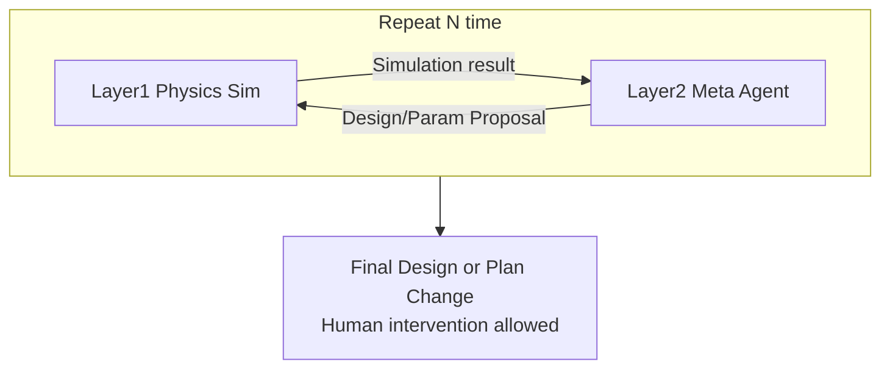

# Engineering Agents — 運用概念（ConOps）

プログラム: **Engineering Agents**（ソフトウェア）。One Piece Engineering が管理する最初のプログラム例。  
ドメイン／プラント物理（船室大気・スクラバ等）は本ソフトウェアプログラムの要求ではない。エージェントが扱う中身のモデル側である。

## 目的

**決定論的な真実ゲート**付きで、ハードウェア向け設計・検証ループを加速する。LLM は提案してよいが、自己申告だけでは合格にしない。

## 運用ループ

1. **Layer 1 — 物理シミュレーション**  
   プラント／backend シナリオを実行。複数エージェントが異常検知 → 原因特定 → 運用対応（一時的な運転操作）を行う。

2. **Layer 2 — メタエージェント評価**  
   シミュレーション結果を評価し、次反復向けの **設計またはパラメータ提案** を出す。

3. **N 回反復**  
   **N は運用者が指定する。**

4. **出力**  
   **Final Design or Plan Change。** 人間介入は可能だが、介在は **時間ボトルネック** になる。

## 権威と真実

- 設計・検証ループの既定経路は **AI エージェント**が回し、人間意思決定の遅延を避ける。
- **真実を求めること必須:** 提案の材料は決定論シム・制約・証拠に限る。LLM の自己申告のみでは足りない。
- 人間は介入できる（停止・却下・N 変更・提案拒否）。介入可能であることと、常用すると時間ボトルネックになることは両立する。

## ミニマムサクセス（妥当性確認ゲート）

1. **Cycle 1:** L1↔L2（N ≥ 1）を回し、非空の設計／パラメータ提案を出す。  
2. **Cycle 2:** 提案を適用して再シミュレーションし、Cycle 1 と **結果が異なる**。

ソフトウェア検証ケース `VC-ea-loop-2run` にアンカー（[verification.md](verification.md)）。

## 関連

- [requirements.md](requirements.md)
- [system_graph.md](system_graph.md)
- [validation.md](validation.md)
