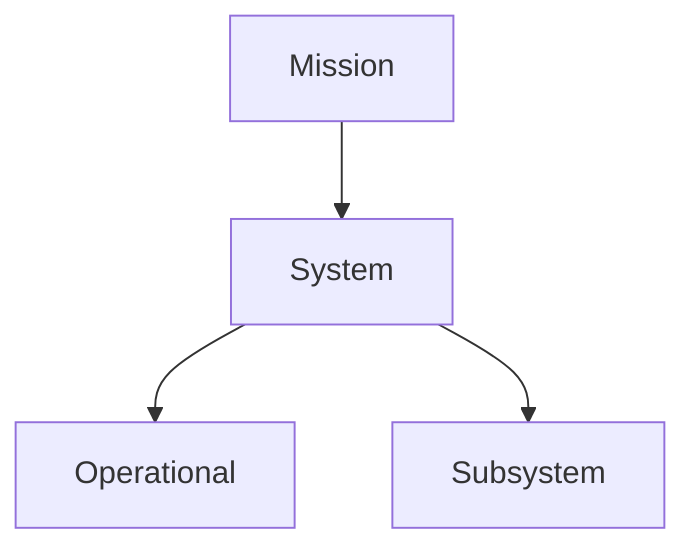

# Engineering Agents — 要求

Engineering Agents プログラムのソフトウェア要求。  
正本 ID・関係: [system_model.md](system_model.md)、[model/requirements.yaml](../../en/programs/engineering_agents/model/requirements.yaml)。

## 階層

親が子を駆動: `derive(parent, child)`。

## Mission

| ID | Shall |
|----|-------|
| `EA-SW-MIS-001` | Engineering Agents ソフトウェアは、決定論的真実ゲートの下でハードウェア向け設計・検証ループを加速しなければならない。 |

## System

| ID | Shall |
|----|-------|
| `EA-SW-SYS-010` | システムは運用者指定の反復回数 N で Layer-1 物理シムと Layer-2 メタエージェント評価を実行し、Final Design or Plan Change を出力しなければならない。 |
| `EA-SW-SYS-020` | システムは提案の真偽を決定論シム結果・制約・証拠のみで判定しなければならず、LLM の自己申告のみでは合格としてはならない。 |

## Operational

| ID | Shall |
|----|-------|
| `EA-SW-OPS-010` | 運用者は N・scenario・agents_mode・run_id・提案適用を指定してループを実行できなければならない。 |
| `EA-SW-OPS-020` | システムは人間介入を可能にしなければならない（常用介入は時間ボトルネックになりうる）。 |

## Subsystem

| ID | Shall |
|----|-------|
| `EA-SW-SUB-CLI-010` | CLI サブシステムは実行制御・結果参照・診断を提供しなければならない。 |
| `EA-SW-SUB-SCN-010` | scenario サブシステムはシムとエージェント実行をオーケストレーションしなければならない。 |
| `EA-SW-SUB-AGT-010` | agents サブシステムは L1 運用対応と L2 メタ評価および設計／パラメータ提案を行わなければならない。 |
| `EA-SW-SUB-ENV-010` | environment サブシステムは外部シム／plant backend との境界を隔離しなければならない。 |
| `EA-SW-SUB-CORE-010` | core サブシステムは共有状態・提案スキーマ・実行成果物の永続化を担わなければならない。 |

## 注

- これらは **ソフトウェア**要求である。ドメイン／プラントの shall はここに載せない。
- 検証へのトレース: [verification.md](verification.md)、[matrix.md](matrix.md)。
