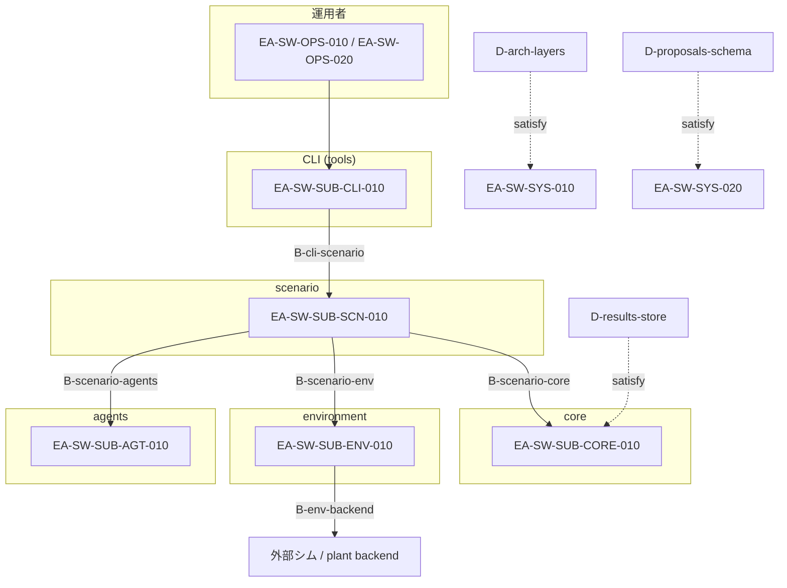
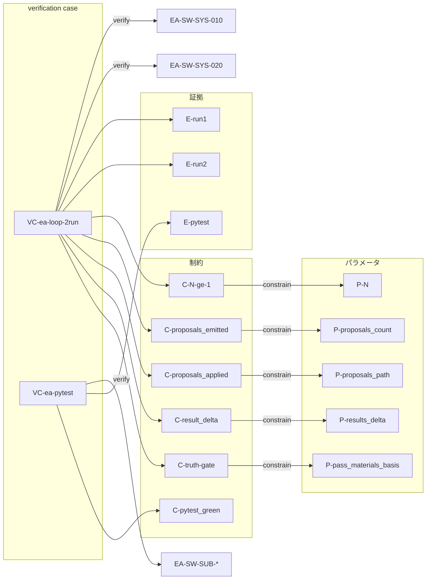
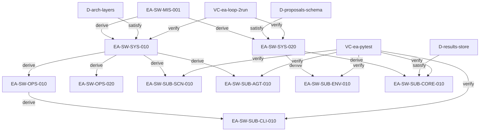

# Engineering Agents — システムモデル

Engineering Agents プログラムの正本ソフトウェア・システムモデル。  
機械可読: [model/system_model.yaml](../../../en/programs/engineering_agents/model/system_model.yaml)（model は en を正とする）。  
関係凡例は動詞の基本形。SysML の区別を取り入れるがフル準拠は必須ではない。

## スコープ

- **対象:** EA *ソフトウェア* の要求・パラメータ・制約・境界・設計・verification case・証拠
- **要求ノードにしない:** ドメイン／プラント物理（ソフトウェアが扱い得る中身であり、本プログラムの要求ではない）

## システムモデル図

ソフトウェアの層構造・境界（`allocate`）・外部バックエンド。ドメイン／プラント物理は本モデルの外側。

verification case・制約・証拠がシステム要求のループを閉じる（真実ゲート: LLM 自己申告のみで合格としない）。

## 関係凡例

| 関係 | 形 | 意味 |
|------|----|------|
| **derive** | `derive(parent, child)` | 親要求が子要求を導出・分解する（親が子を駆動） |
| **satisfy** | `satisfy(design, requirement)` | 設計／実装が要求を満たすという主張 |
| **verify** | `verify(verification_case, requirement)` | 検証ケースが要求を証明する |
| **allocate** | `allocate(element, requirement)` | 境界／サブシステムに要求の責任を割り当てる |
| **constrain** | `constrain(constraint, parameter)` | 制約がパラメータを拘束する |

**verification case（第一級）:** どの要求か／何をもってか／どう判定か、を必ず持つ。

ノード種: `requirement`, `parameter`, `constraint`, `boundary`, `design`, `verification_case`, `evidence`。

## 要求

| ID | 文 |
|----|----|
| `EA-SW-MIS-001` | 決定論ゲート付きでハードウェア向け設計・検証ループを加速する |
| `EA-SW-SYS-010` | L1↔L2 を運用者指定の N 回実行し Final Design or Plan Change を出力する |
| `EA-SW-SYS-020` | 提案の真偽材料は決定論シム／制約／証拠のみ（LLM 自己申告のみで合格としない） |
| `EA-SW-OPS-010` | 運用者は N・scenario・agents_mode・run_id・提案適用を指定して実行できる |
| `EA-SW-OPS-020` | 人間介入を可能にする（介在は時間ボトルネックになりうる） |
| `EA-SW-SUB-CLI-010` | CLI が実行・結果参照・診断を提供する |
| `EA-SW-SUB-SCN-010` | scenario がシムとエージェント実行をオーケストレーションする |
| `EA-SW-SUB-AGT-010` | agents が L1（運用対応）と L2（メタ評価・設計／パラメータ提案）を担う |
| `EA-SW-SUB-ENV-010` | environment が外部シム／plant backend との境界を隔離する |
| `EA-SW-SUB-CORE-010` | core が共有状態・提案スキーマ・実行結果の永続化を担う |

階層: Mission → System。System → Operational **および** Subsystem（`derive`）。

## パラメータと制約

| ID | 種 | 内容 |
|----|----|------|
| `P-N` | parameter | 反復回数 N |
| `P-agents_mode` | parameter | エージェントモード |
| `P-run_id` | parameter | 実行 ID（証拠キー） |
| `P-proposals_path` | parameter | 適用する proposals パス（空＝未適用） |
| `P-proposals_count` | parameter | 出力 proposals 件数 |
| `P-results_delta` | parameter | Cycle2 の追跡出力が Cycle1 と異なるか（E-run1 と E-run2 から導出） |
| `P-pass_materials_basis` | parameter | 合格判定の記録根拠（sim / constraint / evidence。LLM のみは不可） |
| `C-N-ge-1` | constraint | `P-N >= 1` |
| `C-proposals_emitted` | constraint | Cycle1 後 `P-proposals_count >= 1` |
| `C-proposals_applied` | constraint | Cycle2 適用時 `P-proposals_path` が非空 |
| `C-result_delta` | constraint | `P-results_delta` が true |
| `C-truth-gate` | constraint | `P-pass_materials_basis` が LLM 自己申告のみを除外する |
| `C-pytest_green` | constraint | 回帰スイート成功 |

## 境界・設計・verification case・証拠

| ID | 種 | 内容 |
|----|----|------|
| `B-cli-scenario` | boundary | CLI ↔ scenario |
| `B-scenario-agents` | boundary | scenario ↔ agents |
| `B-scenario-env` | boundary | scenario ↔ environment |
| `B-scenario-core` | boundary | scenario ↔ core |
| `B-env-backend` | boundary | environment ↔ 外部シム／plant backend |
| `D-arch-layers` | design | tools → scenario → environment/agents → core |
| `D-proposals-schema` | design | 提案スキーマと適用経路 |
| `D-results-store` | design | summary／telemetry／messages の保存 |
| `VC-ea-loop-2run` | verification_case | Cycle1 → proposals → Cycle2（適用再実行） |
| `VC-ea-pytest` | verification_case | 開発用回帰スイート |
| `E-run1` / `E-run2` / `E-pytest` | evidence | 実行／テスト成果物 |

## 関係

英語版 [system_model.md](../../../en/programs/engineering_agents/system_model.md) および [model/system_model.yaml](../../../en/programs/engineering_agents/model/system_model.yaml) と同一の `derive` / `constrain` / `allocate` / `satisfy` / `verify` 一覧を正とする。

### verification case 三点セット

**`VC-ea-loop-2run`** — どの要求: SYS-010/020／何をもって: CLI→scenario、Cycle1 実行→proposals 出力→Cycle2 適用再実行／どう判定: `C-N-ge-1`, `C-proposals_emitted`, `C-proposals_applied`, `C-result_delta`, `C-truth-gate`（E-run1/E-run2）。

**`VC-ea-pytest`** — どの要求: `EA-SW-SUB-*`／何をもって: 回帰スイート／どう判定: `C-pytest_green`（E-pytest）。

### 要求グラフ

